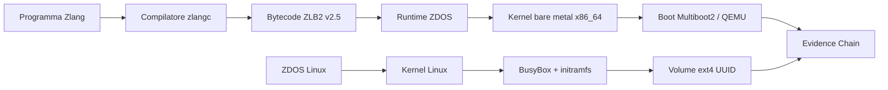

# ZDOS

**Sistema operativo sperimentale, runtime e toolchain verificabile per sistemi x86_64.**

[](https://github.com/high-cde/ZDOS/actions/workflows/validate-x86_64.yml)
[](distro/)
[](os/x86_64/)
[](https://github.com/high-cde/Zlang)
[](LICENSE)

> **Build what you can prove.**
>
> ZDOS è un ecosistema in costruzione che unisce una distribuzione Linux minimale, un prototipo bare-metal x86_64, il linguaggio Zlang, il runtime ZLB2 e una Evidence Chain locale. Una capacità viene considerata disponibile soltanto quando esistono implementazione, contratto, test e una prova riproducibile.

## Indice

- [Cos’è ZDOS](#cosè-zdos)
- [Stato del progetto](#stato-del-progetto)
- [Architettura](#architettura)
- [ZDOS Linux](#zdos-linux)
- [Persistent Storage v1](#persistent-storage-v1)
- [Zlang e runtime ZLB2](#zlang-e-runtime-zlb2)
- [Evidence Chain](#evidence-chain)
- [Micro-mondo connesso](#micro-mondo-connesso)
- [Avvio rapido](#avvio-rapido)
- [Struttura del repository](#struttura-del-repository)
- [Verifica e riproducibilità](#verifica-e-riproducibilità)
- [Sicurezza e modello di fiducia](#sicurezza-e-modello-di-fiducia)
- [Limiti attuali](#limiti-attuali)
- [Roadmap](#roadmap)
- [Contribuire](#contribuire)
- [Licenza](#licenza)

## Cos’è ZDOS

ZDOS è una piattaforma sperimentale per costruire sistemi x86_64 piccoli, osservabili e verificabili. Il repository contiene due percorsi tecnici distinti:

| Percorso | Scopo | Stato attuale |
|---|---|---|
| **ZDOS Linux** | Distro minimale basata su kernel Linux, BusyBox e initramfs | ISO x86_64 avviabile; persistenza ext4 verificata in QEMU |
| **ZDOS bare metal** | Kernel freestanding con bootstrap Multiboot2 e runtime Zlang incorporato | Prototipo avviabile e verificabile in QEMU/CI |
| **Integrazione Zlang** | Compilazione di programmi Zlang e produzione di bytecode ZLB2 | Toolchain e profilo ZLB2 v2.5 disponibili nel repository [Zlang][1] |
| **Evidence Chain** | Ledger JSONL append-only con hash concatenati e attestazioni locali | Pipeline di build e boot verificabile senza networking o mining |

ZDOS non è ancora una distribuzione general-purpose né un sostituto pronto per Debian, Ubuntu o altri sistemi operativi quotidiani. È una **base di sviluppo reale**, progettata per rendere esplicito ciò che è stato costruito, ciò che è stato testato e ciò che resta da implementare.

## Stato del progetto

La maturità viene descritta per capacità, non soltanto per versione. Lo stato corrente è il seguente:

| Capacità | Stato | Prova disponibile |
|---|---|---|
| Build della distro Linux | **Disponibile** | `distro/build.sh` |
| Boot Linux in QEMU | **Disponibile** | `distro/test-qemu.sh` |
| Shell BusyBox e initramfs | **Disponibile** | Boot seriale con `ZDOS_READY` |
| Volume persistente ext4 | **Verificato** | `distro/test-persistence-qemu.sh` a due boot |
| Kernel/moduli coerenti | **Controllato** | Guard in `distro/build.sh` |
| Runtime ZLB2 bare metal | **Sperimentale verificato** | `os/x86_64/tools/verify_qemu.sh` |
| Evidence Chain locale | **Disponibile** | `evidence/ledger.py` |
| Installer BIOS/UEFI | Non ancora disponibile | Roadmap |
| Package manager e aggiornamenti | Non ancora disponibili | Roadmap |
| Supporto hardware laptop | Non ancora certificato | Test futuri |

La milestone Linux corrente può essere descritta come **M2 — Reproducible**: la build produce un’immagine riproducibile, il boot è osservabile in QEMU e il test persistent-storage-v1 dimostra la sopravvivenza dei dati tra due boot indipendenti.

## Architettura



I due percorsi condividono principi e strumenti, ma non devono essere confusi. **ZDOS Linux** usa il kernel Linux e BusyBox per fornire una distro minimale. **ZDOS bare metal** è un laboratorio freestanding che integra il runtime Zlang nel kernel e segue un contratto diverso.

## ZDOS Linux

La distro Linux viene costruita da sorgenti versionate usando un kernel x86_64, BusyBox statico, un initramfs e una configurazione minimale. Il sistema avvia una shell seriale e una console virtuale; la rete può essere tentata tramite BusyBox `udhcpc`, ma non è una precondizione per l’avvio.

La sequenza di boot è:

```text
kernel Linux
→ initramfs
→ /init
→ mount di proc, sysfs, devtmpfs e run
→ caricamento dei moduli storage
→ mount opzionale di /mnt/data
→ shell BusyBox
→ ZDOS_READY
```

Le caratteristiche attuali sono:

| Area | Comportamento |
|---|---|
| Userspace | BusyBox statico con shell e utility essenziali |
| Init | Script POSIX `/init` con fallback `live-only` |
| Console | `ttyS0` per QEMU e console virtuale |
| Networking | Tentativo DHCP su `eth0`, non garantito |
| Storage | ext4 opzionale, identificato da UUID |
| Boot | ISO GRUB BIOS e avvio diretto kernel/initramfs in QEMU |
| Failure mode | Il sistema continua in modalità live se lo storage non è disponibile |

## Persistent Storage v1

`persistent-storage-v1` è la prima capacità di persistenza verificata nella distro Linux. Usa un volume ext4 dedicato, identificato da UUID e montato su `/mnt/data`.

Il comportamento è intenzionalmente conservativo:

- il volume viene selezionato tramite UUID, non tramite un nome volatile soltanto;
- su un disco partizionato può essere usato `/dev/vda1`, `/dev/sda1` o `/dev/hda1`;
- nelle immagini QEMU del test può essere usato direttamente il device intero `/dev/vda`, `/dev/sda` o `/dev/hda`;
- il sistema non formatta automaticamente il volume;
- un UUID errato, un filesystem non leggibile o un volume assente producono fallback `live-only`;
- il contenuto del volume non viene copiato nella Evidence Chain.

Il contratto di boot è:

```text
zdos.data_uuid=<UUID>
zdos.persistence_test=write|read
```

Il test riproducibile crea un’immagine raw QEMU da 128 MiB, la formatta con ext4, esegue un primo boot che scrive un marker e un secondo boot che lo rilegge. Il successo richiede entrambi i passaggi.

```sh
./distro/test-persistence-qemu.sh
```

Su una macchina in cui il kernel usato per la distro non coincide con il kernel attivo, è necessario fornire una coppia coerente di kernel e moduli:

```sh
ZDOS_KERNEL=/boot/vmlinuz-$(uname -r) \
ZDOS_MODULES_DIR=/lib/modules/$(uname -r) \
./distro/test-persistence-qemu.sh
```

Il risultato atteso è:

```text
ZDOS_PERSISTENCE_WRITE_OK
ZDOS_PERSISTENCE_READ_OK
ZDOS_PERSISTENCE_QEMU_TEST_PASSED uuid=11111111-2222-4333-8444-555555555555
```

Questa milestone dimostra la persistenza nella distro Linux in QEMU. Non è ancora un filesystem nativo del kernel bare metal e non espone automaticamente storage ai programmi Zlang.

## Zlang e runtime ZLB2

Il repository [Zlang][1] contiene il compilatore e il profilo del bytecode. ZDOS fornisce il target bare metal e il runtime che valida ed esegue il programma incorporato nel kernel sperimentale.

La pipeline utilizza il contratto **ZLB2 v2.5**. Il runtime controlla magic e versione, i limiti dei record, gli opcode supportati e la chiusura corretta tramite `HALT`. Le capacità non collegate a capability sicure e a test riproducibili restano fuori dal profilo operativo.

Il riferimento tecnico è il [profilo ZLB2 v2.5][2]. Per il target x86_64:

```sh
cd os/x86_64
make clean
make verify
sh tools/verify_qemu.sh
```

L’output atteso del bootstrap bare metal è simile a:

```text
ZDOS x86_64 bootstrap
Zlang runtime ZLB2 v2.5 ready
ZDOS: native Zlang program executed
ZDOS: Zlang halted cleanly
```

## Evidence Chain

La Evidence Chain è un ledger locale in formato JSONL. Ogni evento contiene il proprio payload, il riferimento alla sequenza e l’hash dell’evento precedente; la verifica rileva riordino, alterazioni e rotture della catena.

Il ledger non è una blockchain pubblica e non implementa consenso distribuito. Non utilizza token, saldi o mining e non deve contenere password, chiavi private, token, dati personali o contenuti sensibili.

La pipeline evolutiva collega compilatore Zlang, kernel ZDOS, boot QEMU e attestazione:

```sh
ZLANG_ROOT=../Zlang ./scripts/evolve-zlang-evidence.sh
```

La pipeline registra un evento `zlang.zdos.evolution` soltanto dopo il superamento dei gate. L’evento può contenere hash di sorgente, bytecode, header generato, log seriale e commit dei repository, ma non il contenuto privato del sistema.

### Storage read-v1 in Zlang by ZDOS

La capability `storage.read-v1` porta la persistenza verificata di ZDOS Linux nel percorso Zlang tramite un bridge read-only confinato. Un programma può dichiarare:

```zlang
storage.read ".zdos-persistence-marker"
```

Il bridge viene eseguito soltanto con un namespace esplicito, per esempio:

```sh
python3 ../Zlang/tools/zlang_storage_read.py program.zlang \
  --root /mnt/data \
  --max-bytes 4096
```

Il contratto consente soltanto path relativi, rifiuta `..`, path assoluti, NUL byte e accesso a `/dev`, applica una quota di lettura e non espone operazioni di scrittura. L’esito include path relativo, dimensione e hash del contenuto, senza stampare o registrare automaticamente dati privati nella Evidence Chain.

Il compilatore Zlang emette l’opcode ZLB2 `0x06 — STORAGE_READ`. Il runtime bare-metal ZDOS lo riconosce e lo valida, ma dichiara esplicitamente che l’esecuzione richiede il bridge Linux fino all’implementazione di un filesystem nativo nel kernel freestanding. Questa distinzione è intenzionale: la capability Linux è reale e testata; il filesystem bare-metal resta una milestone futura.

Per verificare la capability nel repository Zlang:

```sh
cd ../Zlang
python3 tests/test_storage_read_v1.py
```

Per verificare un ledger:

```sh
python3 evidence/ledger.py --ledger /path/to/evidence.jsonl verify
```

Per attestare il test di persistenza dopo due boot riusciti:

```sh
ZLANG_ROOT=../Zlang \
ZDOS_KERNEL=/boot/vmlinuz-$(uname -r) \
ZDOS_MODULES_DIR=/lib/modules/$(uname -r) \
LEDGER=/var/lib/zdos-node/evidence.jsonl \
./scripts/attest-persistence-evidence.sh
```

L’evento `filesystem.persistence.attestation` registra UUID, tipo filesystem, mount point, hash dell’immagine QEMU, hash del marker, numero di boot, commit ZDOS e kernel. Non registra il contenuto del filesystem né dati privati.

Per la specifica operativa, consultare [`evidence/README.md`](evidence/README.md).

## Micro-mondo connesso

Il repository include un **micro-mondo connesso** che incorpora il modello di coordinamento di ZDOS Lab senza trasformare copie locali in fonti autorevoli. Il catalogo [`microcosm/catalog.json`](microcosm/catalog.json) dichiara componenti, repository primari, ruolo, stato e controlli; il contratto [`microcosm/contract.json`](microcosm/contract.json) rende espliciti i gate di promozione, i limiti e il divieto di sincronizzazioni distruttive.

| Comando | Funzione | Effetto sui repository |
|---|---|---|
| `./microcosm/zdos-microctl inspect` | Fotografa checkout, commit e stati dichiarati | Sola lettura |
| `./microcosm/zdos-microctl manifest` | Produce un report con hash di catalogo e contratto | Scrive solo un artefatto locale ignorato da Git |
| `./microcosm/zdos-microctl sync --check` | Controlla le precondizioni di allineamento | Sola lettura |
| `./microcosm/zdos-microctl sync --apply` | Aggiorna checkout puliti con fast-forward soltanto | Nessun reset o force-push |
| `./microcosm/zdos-microctl gate` | Valida entrypoint, policy, catalogo e contratto | Sola lettura |
| `./microcosm/zdos-microctl attest-persistence` | Esegue due boot QEMU e registra l'attestazione | Genera build e ledger locali |

Il collegamento già **VERIFIED** è `persistent-storage-evidence-v1`: due boot QEMU, marker di scrittura e lettura, clean shutdown, quindi evento `filesystem.persistence.attestation` in una Evidence Chain verificata. Zlang, zdos-organism, ZDOS-SEC-PORTAL e Z-CYBERCORE restano fonti primarie esterne, con stati `PREPARED` o `EXPERIMENTAL` finché non sono disponibili i rispettivi checkout e controlli. La specifica completa è in [`docs/MICROCOSM.md`](docs/MICROCOSM.md).

## Avvio rapido

### Prerequisiti

La build richiede una toolchain Linux x86_64 e i seguenti comandi:

```text
curl make gcc file cpio gzip xorriso grub-mkrescue mtools
qemu-img qemu-system-x86_64 mkfs.ext4 timeout
```

Per il test bare metal sono inoltre necessari gli strumenti indicati in [`os/x86_64/README.md`](os/x86_64/README.md). Il test QEMU utilizza soltanto immagini virtuali locali e non modifica dischi fisici.

### Costruire la distro Linux

Dalla radice del repository:

```sh
git clone https://github.com/high-cde/ZDOS.git
cd ZDOS
./distro/build.sh
```

La build produce:

```text
distro/build/zdos-linux-x86_64.iso
```

Per avviare la ISO in console seriale:

```sh
qemu-system-x86_64 \
  -cdrom distro/build/zdos-linux-x86_64.iso \
  -serial stdio \
  -display none
```

L’output deve includere `ZDOS_READY`. L’assenza di una rete o di un volume persistente non impedisce il boot: in quel caso il sistema mostra `live-only`.

### Verificare la persistenza

```sh
./distro/test-persistence-qemu.sh
```

### Verificare Zlang e il target bare metal

I repository possono essere clonati in directory affiancate:

```sh
git clone https://github.com/high-cde/ZDOS.git
git clone https://github.com/high-cde/Zlang.git
cd ZDOS
ZLANG_ROOT=../Zlang ./scripts/evolve-zlang-evidence.sh
```

## Struttura del repository

| Percorso | Responsabilità |
|---|---|
| [`distro/`](distro/) | Build Linux, root filesystem, initramfs e test QEMU |
| [`os/x86_64/`](os/x86_64/) | Kernel bare metal, bootstrap Multiboot2 e runtime ZLB2 |
| [`evidence/`](evidence/) | Ledger, attestatore Zlang–ZDOS e test Evidence Chain |
| [`scripts/`](scripts/) | Pipeline di evoluzione, sincronizzazione e verifiche |
| [`core/`](core/) | Cortex, AAAK, memoria e componenti di ricerca |
| [`network/`](network/) | Nodi e servizi distribuiti |
| [`interface/`](interface/) | CLI, dashboard e interfacce cloud |
| [`dev/zen/`](dev/zen/) | Toolchain e automazione dello sviluppo |
| [`docs/`](docs/) | Architettura, operazioni, contratti e roadmap |

I componenti di ricerca non devono essere confusi con la superficie minima e verificata della distro Linux.

## Verifica e riproducibilità

Per controllare la qualità della working tree:

```sh
git diff --check
```

Per sincronizzare e verificare i componenti dell’ecosistema:

```sh
./scripts/sync-ecosystem.sh
```

Lo script aggiorna soltanto branch fast-forward, rifiuta working tree locali non puliti e si arresta al primo errore reale. Non esegue reset distruttivi.

Per una verifica completa, registrare almeno:

| Evidenza | Domanda |
|---|---|
| Hash del sorgente | Quale programma è stato compilato? |
| Hash del bytecode | Quale artefatto è stato prodotto? |
| Versione kernel/moduli | L’initramfs è compatibile? |
| Log seriale | Il guest ha raggiunto il marker atteso? |
| Ledger verificato | L’evento è integro e ordinato? |

## Sicurezza e modello di fiducia

ZDOS segue un modello **default-deny**. Le capacità devono essere dichiarate, limitate e verificabili; un programma non deve ottenere accesso implicito a rete, dispositivi a blocchi, filesystem host o dati privati.

La persistenza v1 non formatta dispositivi automaticamente e usa soltanto un UUID dichiarato. I test sono progettati per usare immagini QEMU locali. Prima di usare una futura immagine su hardware reale è necessario verificare il dispositivo di destinazione e predisporre un backup.

Il portale SEC contiene endpoint orientati alla build e, nel codice corrente, una password di sviluppo hard-coded. **Non esporre il portale su Internet** senza autenticazione reale, secret tramite environment, rate limiting, validazione degli URL, sandbox del compilatore e audit degli eventi. Per i dettagli, consultare la documentazione del [portale ZDOS-SEC][3].

La Evidence Chain locale garantisce integrità e ordine delle prove, non autenticità forte multi-organizzazione. PKI distribuita, consenso BFT, storage remoto delle prove e firma crittografica degli eventi sono capacità future.

## Limiti attuali

ZDOS Linux è una base di distro e non deve essere presentata come un sistema operativo general-purpose completo. Al momento non sono ancora disponibili o certificati:

- installer persistente BIOS/UEFI;
- aggiornamenti atomici firmati e rollback;
- package manager completo e repository di pacchetti;
- gestione completa di utenti, gruppi e policy;
- rete general-purpose e configurazione hardware automatica;
- supporto certificato a Wi-Fi, audio, grafica, touchpad, NVMe e sospensione;
- filesystem nativo nel kernel bare metal;
- accesso storage controllato dai programmi Zlang nel runtime bare-metal; il bridge Linux `storage.read-v1` read-only è disponibile separatamente e confinato;
- matrice hardware per laptop reali.

Il supporto ext4 verificato in QEMU è una milestone concreta, ma non equivale a compatibilità universale con hardware fisico.

## Roadmap

| Milestone | Obiettivo |
|---|---|
| **0.2 — Base Linux** | Kernel Linux, BusyBox, initramfs, shell, utenti e boot verificabile |
| **0.2.x — Persistent Storage v1** | ext4 tramite UUID, fallback live-only e test a due boot |
| **0.3 — Package foundation** | Pacchetti tar firmati e repository dichiarativo |
| **0.4 — Installabilità** | Installer BIOS/UEFI, recovery e immagini installabili |
| **0.5 — Operabilità** | Logging persistente, aggiornamenti atomici e rollback |
| **M3 — Capability storage** | Accesso read-only isolato allo storage da Zlang |
| **M4 — Hardware preview** | Test su laptop dedicati e matrice hardware pubblica |

Una milestone non viene promossa finché non possiede un contratto, un test positivo, un test negativo e una prova riproducibile.

## Contribuire

Prima di proporre una nuova capacità, descrivi il contratto, i limiti, gli errori attesi, il test positivo e almeno un test negativo. Mantieni le modifiche circoscritte e aggiorna la documentazione quando cambia il comportamento.

```sh
git checkout -b feat/nome-della-modifica
# modifica e verifica
git diff --check
git status --short
git commit -m "feat: descrivi la modifica"
git push origin feat/nome-della-modifica
```

Consulta [`CONTRIBUTING.md`](CONTRIBUTING.md), [`SECURITY.md`](SECURITY.md), [`CODE_OF_CONDUCT.md`](CODE_OF_CONDUCT.md) e [`SUPPORT.md`](SUPPORT.md) prima di contribuire.

## Documentazione correlata

| Risorsa | Scopo |
|---|---|
| [`distro/README.md`](distro/README.md) | Build Linux e persistent-storage-v1 |
| [`evidence/README.md`](evidence/README.md) | Contratto Evidence Chain |
| [`docs/ECOSYSTEM.md`](docs/ECOSYSTEM.md) | Mappa dei repository e dei contratti |
| [`docs/OPERATIONS.md`](docs/OPERATIONS.md) | Build, boot, CI, troubleshooting e release |
| [`docs/FOUNDATION.md`](docs/FOUNDATION.md) | Principi fondativi |
| [`docs/MATURITY.md`](docs/MATURITY.md) | Modello di maturità |
| [`ARCHITECTURE.md`](ARCHITECTURE.md) | Architettura generale |
| [`CONTRIBUTING.md`](CONTRIBUTING.md) | Workflow per i contributi |
| [`SECURITY.md`](SECURITY.md) | Segnalazioni e principi di sicurezza |
| [`CHANGELOG.md`](CHANGELOG.md) | Modifiche rilevanti |
| [Zlang][1] | Compilatore e linguaggio |
| [Profilo ZLB2 v2.5][2] | Contratto bytecode x86_64 |
| [ZDOS-SEC Portal][3] | Repository separato del portale SEC |

## Licenza

Questo progetto è distribuito secondo la licenza indicata in [`LICENSE`](LICENSE).

---

**ZDOS · Zlang** — *Build what you can prove.*

## Riferimenti

[1]: https://github.com/high-cde/Zlang "Repository Zlang"
[2]: https://github.com/high-cde/Zlang/blob/main/docs/zdos-x86_64-profile.md "Profilo ZLB2 v2.5 per ZDOS x86_64"
[3]: https://github.com/high-cde/ZDOS-SEC-PORTAL "ZDOS-SEC Portal"
