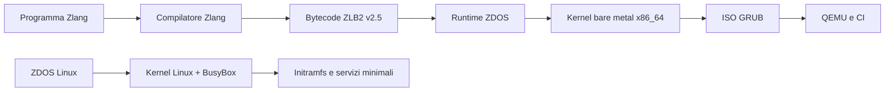

# ZDOS

**Sistema operativo sperimentale, runtime e toolchain per sistemi x86_64.**

[](https://github.com/high-cde/ZDOS/actions/workflows/validate-x86_64.yml)
[](distro/)
[](os/x86_64/)
[](https://github.com/high-cde/Zlang)
[](LICENSE)

> ZDOS è un ecosistema in costruzione che riunisce una distribuzione Linux minimale, un prototipo bare-metal x86_64, il runtime del linguaggio Zlang e gli strumenti necessari per svilupparli e verificarli. Una capacità viene considerata disponibile solo quando esistono implementazione, test e una prova riproducibile.

## Panoramica

ZDOS mantiene due percorsi tecnici distinti ma coordinati:

| Percorso | Scopo | Stato attuale |
|---|---|---|
| **ZDOS Linux** | Distribuzione live minimale basata su kernel Linux, BusyBox e initramfs | ISO x86_64 avviabile e verificata in QEMU |
| **ZDOS bare metal** | Kernel freestanding x86_64 con bootstrap Multiboot2 | Prototipo avviabile con runtime Zlang incorporato |
| **Integrazione Zlang** | Esecuzione di bytecode secondo il contratto ZLB2 v2.5 | Catena compilatore–kernel verificata in CI e QEMU |

Il repository [Zlang](https://github.com/high-cde/Zlang) contiene il compilatore e la specifica del bytecode. ZDOS fornisce il target bare-metal e il runtime che lo valida ed esegue.

## Architettura dell’ecosistema



## Stato verificato

| Componente | Evidenza riproducibile |
|---|---|
| **ZDOS Linux** | `distro/build.sh`, test QEMU e marker `ZDOS_READY` |
| **ZDOS bare metal** | GitHub Actions e `os/x86_64/tools/verify_qemu.sh` |
| **Runtime Zlang** | Contratto ZLB2 v2.5, validazione dei record e gestione di `HALT` |
| **Pipeline di build** | Workflow CI separati per kernel, ISO Linux e integrazione web |

Queste evidenze descrivono un **prototipo reale e avviabile**, non una distribuzione general-purpose completa.

## Avvio rapido

### ZDOS Linux

```sh
git clone https://github.com/high-cde/ZDOS.git
cd ZDOS
./distro/build.sh
./distro/test-qemu.sh
```

La build produce `distro/build/zdos-linux-x86_64.iso`. Per avviare manualmente la console seriale:

```sh
qemu-system-x86_64 \
  -cdrom distro/build/zdos-linux-x86_64.iso \
  -serial stdio -display none
```

La milestone Linux include l’utente `zdos`, il tentativo DHCP su `eth0` e il mount opzionale di `/dev/vda1` su `/mnt/data`. I dettagli sono disponibili in [`distro/README.md`](distro/README.md).

### ZDOS bare metal con Zlang

Clona i repository in directory affiancate, quindi esegui la verifica del target x86_64:

```sh
git clone https://github.com/high-cde/ZDOS.git

git clone https://github.com/high-cde/Zlang.git
cd ZDOS/os/x86_64
make clean
make verify
sh tools/verify_qemu.sh
```

L’output seriale atteso è:

```text
ZDOS x86_64 bootstrap
Zlang runtime ZLB2 v2.5 ready
ZDOS: native Zlang program executed
ZDOS: Zlang halted cleanly
```

## Struttura del repository

| Percorso | Responsabilità | Documentazione |
|---|---|---|
| `distro/` | Build della distribuzione Linux, root filesystem, initramfs e test QEMU | [`distro/README.md`](distro/README.md) |
| `os/x86_64/` | Kernel bare-metal sperimentale e integrazione ZLB2 | [`os/x86_64/README.md`](os/x86_64/README.md) |
| `core/` | Cortex, AAAK, memoria e componenti di ricerca | [`docs/docs/overview.md`](docs/docs/overview.md) |
| `network/` | Nodi e servizi distribuiti | [`docs/docs/nodes.md`](docs/docs/nodes.md) |
| `interface/` | CLI, dashboard web e interfacce cloud | [`interface/web/README.md`](interface/web/README.md) |
| `dev/zen/` | Toolchain e automazione dello sviluppo | [`dev/zen/README.md`](dev/zen/README.md) |
| `docs/` | Architettura, operazioni, roadmap e contratti | [`docs/README.md`](docs/README.md) |

## Contratto ZLB2 e integrazione

La pipeline bare-metal utilizza il contratto **ZLB2 v2.5** tra compilatore e runtime. Magic e versione vengono validate; ogni record è controllato nei propri limiti; gli opcode sconosciuti vengono rifiutati; `HALT` deve chiudere esattamente il buffer. Il bootstrap esegue attualmente `EMIT`; le altre capacità restano esplicitamente in roadmap finché non sono collegate a capability sicure e testate.

Il riferimento tecnico è il [profilo ZLB2 v2.5](https://github.com/high-cde/Zlang/blob/main/docs/zdos-x86_64-profile.md). Per la procedura completa di integrazione, consultare la documentazione del target [`os/x86_64/`](os/x86_64/).

## Verifica e automazione

Per sincronizzare e verificare i componenti dell’ecosistema in un’unica esecuzione:

```sh
./scripts/sync-ecosystem.sh
```

Lo script aggiorna esclusivamente branch fast-forward, rifiuta working tree locali non puliti ed esegue i gate disponibili per Zlang, ZLB2, bare metal, distribuzione Linux, Evidence Chain e portale SEC. Non esegue reset distruttivi e si arresta al primo errore reale.

La [Evidence Chain](evidence/README.md) è un ledger locale append-only JSONL con hash concatenati, ordine degli eventi e attestazioni di build e boot. Non utilizza token, saldi o mining e non salva dati personali o segreti. Consenso BFT multi-nodo, PKI multi-organizzazione e storage esterno delle prove non sono ancora implementati.

## Limiti e sicurezza

ZDOS non deve essere presentato come una distribuzione general-purpose completa. Restano da implementare o verificare, tra gli altri, package manager, installer, aggiornamenti firmati, gestione utenti completa, filesystem persistente, rete configurabile e una matrice hardware reale.

Il portale SEC contiene endpoint orientati alla build e, nel codice corrente, una password di sviluppo hard-coded. **Non esporlo su Internet** senza autenticazione reale, secret tramite environment, rate limiting, validazione degli URL, sandbox del compilatore e audit degli eventi. Per i dettagli, consultare la documentazione del [portale ZDOS-SEC](https://github.com/high-cde/ZDOS-SEC-PORTAL).

## Documentazione

| Risorsa | Scopo |
|---|---|
| [`docs/ECOSYSTEM.md`](docs/ECOSYSTEM.md) | Mappa dei repository e contratti tra componenti |
| [`docs/OPERATIONS.md`](docs/OPERATIONS.md) | Build, boot, CI, troubleshooting e release |
| [`ARCHITECTURE.md`](ARCHITECTURE.md) | Architettura generale del repository |
| [`CONTRIBUTING.md`](CONTRIBUTING.md) | Workflow per i contributi |
| [`SECURITY.md`](SECURITY.md) | Segnalazioni e principi di sicurezza |
| [`CHANGELOG.md`](CHANGELOG.md) | Modifiche rilevanti e baseline di rilascio |

## Contribuire

Prima di proporre una nuova capacità, descrivi il contratto, i limiti, l’errore atteso, il test positivo e almeno un test negativo. Mantieni le modifiche circoscritte, aggiorna la documentazione quando cambia il comportamento e verifica i link prima di aprire una pull request.

```sh
git checkout -b docs/nome-della-modifica
# modifica e verifica
git diff --check
git commit -m "docs: descrivi la modifica"
git push origin docs/nome-della-modifica
```

Consulta [`CONTRIBUTING.md`](CONTRIBUTING.md), [`SECURITY.md`](SECURITY.md) e [`CODE_OF_CONDUCT.md`](CODE_OF_CONDUCT.md) prima di contribuire.

## Licenza

Questo progetto è distribuito secondo la licenza indicata in [`LICENSE`](LICENSE).

---

**ZDOS · Zlang** — *Build what you can prove.*
