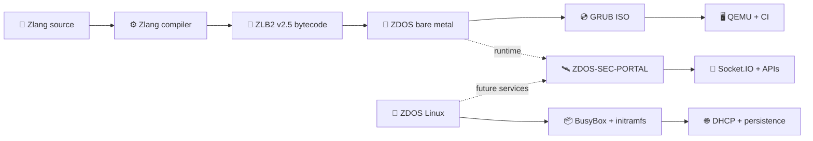

# ZDOS · ecosistema operativo, runtime e strumenti

[](https://github.com/high-cde/ZDOS/actions/workflows/validate-x86_64.yml)
[](distro/)
[](os/x86_64/)
[](https://github.com/high-cde/Zlang)
[](https://github.com/high-cde/ZDOS-SEC-PORTAL)
[](LICENSE)

> **ZDOS è un ecosistema in costruzione:** una distribuzione Linux minimale, un prototipo bare-metal x86_64, il runtime linguistico Zlang, strumenti di sviluppo, servizi di rete e un portale operativo. Ogni capacità viene dichiarata soltanto quando esistono codice, test e una prova osservabile.

## 🧭 Mappa dell’ecosistema



## ✅ Cosa è verificato oggi

| Percorso | Stato | Prova |
|---|---|---|
| 🐧 **ZDOS Linux** | ISO live x86_64 con kernel Linux bootstrap, BusyBox, initramfs, account base, DHCP opzionale e persistenza `/dev/vda1` | `distro/build.sh` + boot QEMU con `ZDOS_READY` |
| 🧠 **ZDOS bare-metal** | Kernel freestanding x86_64, GRUB Multiboot2 e runtime Zlang incorporato | GitHub Actions + `os/x86_64/tools/verify_qemu.sh` |
| ⚙️ **Zlang** | Compilatore ZLB2 v2.5 e contratto bytecode verificato | [Repository Zlang](https://github.com/high-cde/Zlang) |
| 🛰️ **SEC Portal** | HUD web, feed sociale, ledger locale e stream Socket.IO | [Repository ZDOS-SEC-PORTAL](https://github.com/high-cde/ZDOS-SEC-PORTAL) |

## 🚀 Avvio rapido

### ZDOS Linux

```sh
git clone https://github.com/high-cde/ZDOS.git
cd ZDOS
./distro/build.sh
./distro/test-qemu.sh
```

La build produce `distro/build/zdos-linux-x86_64.iso`. Per avviare manualmente la console:

```sh
qemu-system-x86_64 \
  -cdrom distro/build/zdos-linux-x86_64.iso \
  -serial stdio -display none
```

La milestone Linux include l’utente `zdos`, il tentativo DHCP su `eth0` e il mount opzionale di `/dev/vda1` su `/mnt/data`. La procedura completa è descritta in [`distro/README.md`](distro/README.md).

### Prototipo ZDOS x86_64 + Zlang

Per la catena bare-metal, clonare Zlang accanto a ZDOS:

```sh
git clone https://github.com/high-cde/Zlang.git ../Zlang
cd os/x86_64
make clean
make verify
sh tools/verify_qemu.sh
```

L’output seriale atteso è:

```text
ZDOS x86_64 bootstrap
Zlang runtime ZLB2 v2.5 ready
ZDOS: native Zlang program executed
ZDOS: Zlang halted cleanly
```

## 📂 Struttura del repository

| Area | Responsabilità | Documentazione |
|---|---|---|
| `distro/` | Build della distro Linux, root filesystem, initramfs e test QEMU | [`distro/README.md`](distro/README.md) |
| `os/x86_64/` | Kernel bare-metal sperimentale e runtime ZLB2 v2.5 | [`os/x86_64/README.md`](os/x86_64/README.md) |
| `core/` | Cortex, AAAK, memoria e componenti di ricerca | [`docs/docs/overview.md`](docs/docs/overview.md) |
| `network/` | Nodi e servizi distribuiti | [`docs/docs/nodes.md`](docs/docs/nodes.md) |
| `interface/` | CLI, web dashboard e cloud interface | [`interface/web/README.md`](interface/web/README.md) |
| `os/ghostnet/` | Ricerca e componenti del sottosistema Ghostnet | [`os/ghostnet/README.md`](os/ghostnet/README.md) |
| `dev/zen/` | Toolchain e automazione per lo sviluppo | [`dev/zen/README.md`](dev/zen/README.md) |
| `docs/` | Architettura, operazioni, roadmap e contratti | [`docs/README.md`](docs/README.md) |

## 🆕 Novità implementate

La pipeline bare-metal ora usa un runtime **ZLB2 v2.5** coerente con l’header generato dal compilatore: magic e versione vengono validate, ogni record viene controllato nei propri limiti, gli opcode sconosciuti vengono rifiutati e `HALT` deve chiudere esattamente il buffer. Il bootstrap esegue realmente `EMIT`; gli altri record v2.5 vengono validati e restano esplicitamente in roadmap finché non saranno collegate capability sicure.

La build `os/x86_64/update_and_build.sh` è ora parametrica e non interattiva, mentre `scripts/setup_all.sh` controlla le dipendenze e indica gli entrypoint senza dichiarare servizi non avviati. La CI verifica separatamente il boot QEMU bare-metal, la build ISO e il contratto web PHP. La distro Linux continua a essere verificata con `ZDOS_READY` in QEMU.

Il portale web non simula più uno stato operativo: l’endpoint PHP restituisce `LOCAL_STATUS_ONLY` quando Tor non è raggiungibile, espone solo un probe TCP configurabile e dichiara esplicitamente che la risposta non certifica anonimato, cifratura o sicurezza. I controlli dei moduli nella UI sono presentati come laboratorio locale; l’esecuzione remota non viene dichiarata implementata.

L’estetica condivisa può essere applicata con un solo comando: `./scripts/apply-zdos-theme.sh`. Il tema fonde ciano e viola per Zlang, blu per il core ZDOS, verde per gli stati verificati e ambra per le capacità sperimentali. Il comando è idempotente: può essere rieseguito senza duplicare CSS o alterare la logica delle interfacce.

## 🔁 Orchestrazione dell’ecosistema

Per sincronizzare e verificare i tre repository in un’unica esecuzione, usare:

```sh
./scripts/sync-ecosystem.sh
```

L’orchestratore aggiorna soltanto branch fast-forward, rifiuta working tree locali non puliti, esegue test Zlang, gate ZLB2, build/boot bare-metal, build/boot della distro, Evidence Chain e controlli del portale SEC. Non usa reset distruttivi e si arresta al primo errore reale.

## ⛓️ ZDOS Evidence Chain

ZDOS include una prima Evidence Chain non monetaria: un ledger append-only JSONL con hash concatenati, ordine degli eventi, verifica dei limiti e attestazioni di build/boot. Non usa token, saldi o mining e non salva dati personali o segreti. La prova locale completa si avvia con un solo comando:

```sh
./scripts/bootstrap-evidence-chain.sh
```

Il contratto operativo è documentato in [`evidence/README.md`](evidence/README.md), la policy di release in [`evidence/policy.release.json`](evidence/policy.release.json) e il verificatore in [`evidence/ledger.py`](evidence/ledger.py). La versione corrente dimostra integrità e ordine locale; consenso BFT multi-nodo, PKI multi-organizzazione e storage delle prove fuori catena restano attività successive.

## 🛡️ Confini e sicurezza

ZDOS non deve essere presentato come una distro general-purpose completa finché non dispone di package manager, installer, aggiornamenti firmati, gestione utenti completa, filesystem persistente verificato, rete configurabile e test hardware. La base attuale è una milestone reale e avviabile, ma alcune componenti restano sperimentali.

Il portale SEC contiene endpoint che avviano processi di build e, nel codice attuale, una password di sviluppo hard-coded. **Non esporre il portale su Internet senza autenticazione reale, secret tramite environment, rate limiting, validazione degli URL, sandbox del compilatore e audit degli eventi.** Vedere la documentazione del [portale SEC](https://github.com/high-cde/ZDOS-SEC-PORTAL) prima di un deployment.

## 📚 Documentazione essenziale

| Documento | Scopo |
|---|---|
| [`docs/ECOSYSTEM.md`](docs/ECOSYSTEM.md) | Mappa dei repository e contratti tra i componenti |
| [`docs/OPERATIONS.md`](docs/OPERATIONS.md) | Build, boot, CI, troubleshooting e release |
| [`ARCHITECTURE.md`](ARCHITECTURE.md) | Architettura generale del monorepo |
| [`CONTRIBUTING.md`](CONTRIBUTING.md) | Workflow di contributo |
| [`SECURITY.md`](SECURITY.md) | Segnalazioni e principi di sicurezza |
| [Profilo ZLB2 v2.5](https://github.com/high-cde/Zlang/blob/main/docs/zdos-x86_64-profile.md) | Contratto tra compilatore Zlang e runtime ZDOS |
| [ZDOS-SEC-PORTAL](https://github.com/high-cde/ZDOS-SEC-PORTAL) | Portale HUD e API operative |

## 🤝 Contribuire

Prima di proporre una nuova capacità, descrivere il contratto, il limite, l’errore atteso, il test positivo e almeno un test negativo. Le modifiche devono mantenere il linguaggio visuale dell’ecosistema: sezioni leggibili, badge coerenti, diagrammi quando chiariscono l’architettura e limiti dichiarati senza ambiguità.

```sh
git checkout -b docs/nome-della-modifica
# modifica, verifica link e test locali
git diff --check
git commit -m "docs: descrivi la nuova capacità"
git push origin docs/nome-della-modifica
```

## 📜 Licenza

Questo progetto è distribuito secondo la licenza indicata in [`LICENSE`](LICENSE).

---

**ZDOS · Zlang · ZDOS-SEC** · _Build what you can prove._ ✨


## Governance e manutenzione

| Risorsa | Scopo |
|---|---|
| [Wiki](https://github.com/high-cde/ZDOS/wiki) | Architettura, operazioni, roadmap e release. |
| [Changelog](CHANGELOG.md) | Modifiche rilevanti e baseline di rilascio. |
| [Contribuire](CONTRIBUTING.md) | Flusso di lavoro e verifiche per i contributi. |
| [Sicurezza](SECURITY.md) | Segnalazione responsabile e limiti operativi. |
| [Supporto](SUPPORT.md) | Canali e informazioni per le richieste. |
| [Codice di condotta](CODE_OF_CONDUCT.md) | Standard di collaborazione nella comunità. |
