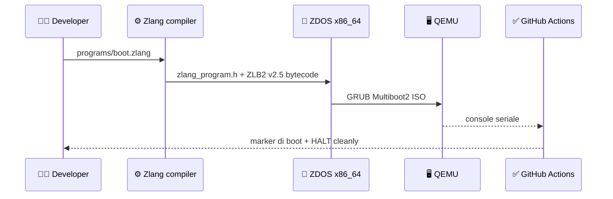

# 🧭 ZDOS Ecosystem Map

## Missione

ZDOS riunisce una base operativa Linux, un laboratorio bare-metal, il runtime Zlang e strumenti di osservabilità e sviluppo. I repository non sono equivalenti: alcuni sono percorsi verificati, altri sono superfici sperimentali. Questa distinzione rende la documentazione credibile e impedisce di confondere una demo con una capacità di produzione.

## Repository e responsabilità

| Repository | Ruolo | Contratto principale | Evidenza attuale |
|---|---|---|---|
| [ZDOS](https://github.com/high-cde/ZDOS) | Kernel sperimentale, distro Linux e orchestrazione dell’ecosistema | Boot, init, runtime, CI e documentazione | ISO Linux live e boot bare-metal QEMU |
| [Zlang](https://github.com/high-cde/Zlang) | Compilatore e specifica del linguaggio | ZLB2 v2.5: record `EMIT`, `LET`, `IF`, `LABEL`, `WAIT`, lunghezze e `HALT` bounds-checked | Test del compilatore e integrazione ZDOS |
| [ZDOS-SEC-PORTAL](https://github.com/high-cde/ZDOS-SEC-PORTAL) | HUD web, feed, ledger locale e stream terminale | API JSON e messaggi Socket.IO | Server Express avviabile e interfaccia HUD |

## Flusso verificato

## Regola di maturità

Una capacità può essere descritta come **verificata** soltanto quando possiede implementazione, contratto, test positivo, test negativo e una procedura riproducibile. In assenza di questi elementi va classificata come **sperimentale**, **parziale** o **roadmap**.

| Livello | Significato | Esempio |
|---|---|---|
| ✅ Verificato | Build e test riproducibili in CI o QEMU | Boot ZDOS x86_64 |
| 🧪 Sperimentale | Codice presente, ma copertura o deployment limitati | Componenti Ghostnet |
| 🧩 Parziale | Parte del flusso funziona, mancano contratti o persistenza | ZDOS Linux 0.2 |
| ⏳ Roadmap | Capacità progettata ma non implementata | Installer e package manager |

## Direzione tecnica

La prossima traiettoria è trasformare la distro Linux live in una piattaforma persistente: kernel compilato da sorgente fissata, filesystem su disco, rete configurabile, utenti e gruppi completi, package manager firmato, installer BIOS/UEFI, aggiornamenti atomici, logging e recovery. Zlang dovrà restare isolato dietro capability esplicite, allowlist, quota, timeout e audit.
