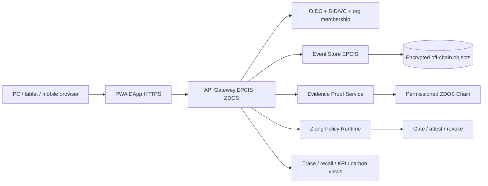

# ZDOS Evidence Chain · Industrial Traceability Platform

## Direzione

La Evidence Chain industriale non deve diventare un semplice “ledger con token”. Deve essere una piattaforma di tracciabilità interoperabile per produttori, fornitori, trasportatori, laboratori, distributori, auditor e clienti.

La fonte di verità operativa deve essere un insieme di **eventi verificabili**. GS1 EPCIS 2.0 è il riferimento più adatto per il vocabolario di filiera: descrive il cosa, quando, dove, perché e come di prodotti e asset, supporta dati di sensori e certificazioni e offre API REST per capture e query.[1] Il Global Traceability Standard organizza questi eventi come Critical Tracking Events (CTE) e Key Data Elements (KDE), con tracciabilità almeno one-up/one-down tra partner.[2]

ZDOS può aggiungere integrità, policy Zlang, identità e attestazioni senza sostituire questi standard.

## Architettura di prodotto



### Principio fondamentale

I documenti, i dati personali, le ricette, i prezzi e i dati industriali riservati restano off-chain, cifrati e soggetti ad autorizzazione. La chain conserva proof, hash, timestamp, schema, issuer, stato e riferimenti minimi. Questo limita la perdita di riservatezza e rende possibile la cancellazione o la rettifica dell'oggetto off-chain senza alterare la storia delle attestazioni.

## Strati

### 1. DApp compatibile con qualsiasi PC

La prima versione deve essere una PWA servita da HTTPS da un dominio reale. Un PC necessita soltanto di browser moderno e account autorizzato. Non deve installare Node, Rust o Zlang per consultare la filiera.

Un agente locale opzionale potrà gestire lettori barcode, stampanti, sensori e import CSV. L'agente non deve essere necessario per consultazione, audit o verifica di un QR/GS1 Digital Link.

La pubblicazione corretta è quindi:

```text
https://app.x-zdos.it/traceability
```

con reverse proxy, TLS, OIDC, rate limit, CSP, audit e backup. `127.0.0.1` resta soltanto per il laboratorio locale. Non basta bindare il servizio a `0.0.0.0` per renderlo industriale.

### 2. Identità e fiducia

Ogni organizzazione ha un identificatore, ruoli e membership. I certificati di laboratorio, conformità e qualifica vengono rappresentati come Verifiable Credentials. W3C VC 2.0 definisce un modello con issuer, holder e verifier e meccanismi per dati verificabili, sicurezza, privacy e revoca.[3]

ZDOS deve implementare:

- `did:zdos` per identità organizzative e dispositivi;
- OIDC per login degli operatori;
- membership firmata per organizzazione, sito e ruolo;
- VC per certificazioni, audit e qualifiche;
- revocation/status list;
- mTLS per integrazioni server-to-server;
- Ed25519 o chiavi hardware-backed per firme operative;
- segregazione tra identità dell'organizzazione e identità del singolo operatore.

### 3. Eventi di filiera

La compatibilità EPCIS richiede eventi di commissioning, receiving, transformation, aggregation, shipping, transporting, installation, maintenance e disposition. Ogni evento ZDOS deve includere almeno:

```json
{
  "event_id": "urn:uuid:...",
  "event_type": "ObjectEvent",
  "action": "OBSERVE",
  "event_time": "2026-10-02T00:00:00Z",
  "event_timezone_offset": "+02:00",
  "what": ["lot:ZDOS-RAW-0001"],
  "where": "loc:ZDOS-PLANT-01",
  "who": "did:zdos:org:example",
  "why": "receiving",
  "biz_step": "receiving",
  "disposition": "in_progress",
  "source": "party:supplier-01",
  "destination": "loc:ZDOS-PLANT-01",
  "kde": {
    "batch": "ZDOS-RAW-0001",
    "quantity": 1000,
    "uom": "EA"
  },
  "proof": {
    "schema": "zdos.proof.v1",
    "object_hash": "sha256:...",
    "issuer": "did:zdos:org:example"
  }
}
```

Le implementazioni ZDOS devono accettare JSON/JSON-LD EPCIS e mantenere un profilo canonico interno senza cambiare il significato degli eventi.

### 4. Storage e prove

Il servizio Event Store conserva eventi EPCIS e indici per query. Il Proof Service canonicalizza il payload, calcola hash, collega il precedente proof e registra l'attestazione nella chain permissioned. Gli oggetti grandi, come PDF, immagini e sensor stream, vanno in object storage cifrato con content-addressed IDs.

La chain deve garantire:

- ordine e finalità degli atti;
- membership dei validator;
- consenso permissioned BFT;
- audit di governance;
- snapshot e restore verificabili;
- rotazione e revoca delle chiavi;
- proof pubblicabile senza rivelare il contenuto originale.

Non è consigliabile inventare un consenso ZDOS da zero. Zlang deve validare transizioni e policy; il networking e il consenso devono usare un motore maturo o un servizio validator separato, con test di partizione, replay, equivocation e perdita nodi.

### 5. Zlang industriale

Zlang/ZLB2 è il livello deterministico per contratti e policy, non il database e non il web server. Le prime capability devono essere:

```text
trace.event.validate-v1
trace.cte-kde.check-v1
trace.proof.commit-v1
trace.credential.verify-v1
trace.dispute.open-v1
trace.recall.plan-v1
```

Un contratto Zlang può verificare che un evento abbia timestamp, oggetto, sito, organizzazione, business step, disposition, issuer e proof. Può rifiutare un evento incoerente, ma non deve auto-assegnare ruoli, leggere segreti o aprire porte.

## Moduli della DApp

La home industriale deve avere moduli permanenti, non modali annidate:

1. **Control Tower** — siti, ordini, ritardi, eccezioni e qualità del dato.
2. **Trace Explorer** — ricerca per GS1 Digital Link, lotto, seriale, pallet, container, ordine o certificato.
3. **Chain of Custody** — timeline one-up/one-down con proof verificabili.
4. **Production & Transformation** — input/output, lotti, ricette e yield con permessi.
5. **Quality & Certificates** — VC di laboratorio, non conformità, scadenze e revoche.
6. **Logistics & Sensors** — temperatura, umidità, geofence e soglie.
7. **Recall Center** — impatto, upstream/downstream, task e conferma ricezione.
8. **Supplier Portal** — onboarding, mapping, API keys e condivisione limitata.
9. **Audit Room** — evidence pack esportabile, proof e log di accesso.
10. **Zlang Policy Studio** — policy versionate, test, simulazione e approvazione a quattro occhi.

## API compatibili

```text
POST /epcis/v2/events
POST /epcis/v2/capture
GET  /epcis/v2/events
POST /zdos/v1/proofs/verify
GET  /zdos/v1/trace/{identifier}
GET  /zdos/v1/chain/head
POST /zdos/v1/credentials/verify
GET  /zdos/v1/organizations/{id}
POST /zdos/v1/recalls
GET  /zdos/v1/audit/export
```

Le API devono supportare idempotency key, cursor pagination, correlation ID, schema version, rate limit, audit trail e risposte `problem+json`. Un connettore partner non deve poter inviare una richiesta arbitraria alla chain.

## Multi-tenancy e privacy

Il tenant è l'organizzazione. Ogni evento ha ACL su organizzazione, sito, ruolo, oggetto e relazione commerciale. Un partner vede soltanto ciò che è necessario per il contratto e per la tracciabilità concordata.

Il dato pubblico può essere un proof minimale. Il dato riservato rimane cifrato. Gli accessi devono essere registrati senza trasformare il log in una copia dei documenti. I dati personali devono avere retention, export e cancellazione secondo il contesto normativo applicabile.

## SLO e qualità

La piattaforma industriale deve misurare:

- disponibilità API;
- latenza capture/query;
- percentuale eventi completi CTE/KDE;
- tempo di verifica proof;
- ritardo di sincronizzazione sensori;
- tempo di propagazione recall;
- errori di mapping partner;
- stato dei validator e delle chiavi;
- audit export riusciti;
- qualità dei dati da 1 a 5.

Nessun evento deve essere dichiarato “tracciabile” se mancano identificatore, tempo, luogo, responsabile o relazione input/output quando richiesta.

## Roadmap eseguibile

### M0 — contratto e MVP locale

- schema CTE/KDE ZDOS;
- adapter EPCIS capture/query;
- Proof Service sopra il ledger attuale;
- verifica Zlang senza mutazioni;
- UI Control Tower e Trace Explorer;
- test JSON schema, replay, duplicati e tampering.

### M1 — filiera pilota

- due organizzazioni, un sito, un lotto e una trasformazione;
- onboarding OIDC e membership;
- certificato VC di laboratorio;
- QR/GS1 Digital Link;
- export audit e recall simulato;
- PWA pubblicata su HTTPS.

### M2 — permissioned chain

- 4 validator appartenenti a organizzazioni separate;
- consenso BFT e governance di membership;
- proof anchor e snapshot;
- key rotation, revocation, disaster recovery;
- test di nodo offline e partizione.

### M3 — industrializzazione

- sensori e connettori ERP/WMS/MES/TMS;
- mapping partner EPCIS/EDI;
- SLA, monitoring, alert e supporto;
- penetration test, threat model e audit indipendente;
- pacchetto compliance per il settore scelto.

## Criterio di prodotto

ZDOS Evidence Chain è pronta per la produzione solo quando può dimostrare, su un caso pilota, che un lotto è rintracciabile dall'origine alla consegna, che ogni passaggio ha CTE/KDE completi, che le credenziali sono verificabili, che il dato riservato non è pubblico, che il proof resiste a manomissione e che un PC comune può consultare il risultato tramite browser HTTPS.

## References

[1]: https://www.gs1.org/standards/epcis "GS1 EPCIS & CBV"
[2]: https://www.gs1.org/standards/gs1-global-traceability-standard/current-standard "GS1 Global Traceability Standard"
[3]: https://www.w3.org/TR/vc-data-model-2.0/ "W3C Verifiable Credentials Data Model v2.0"
[4]: https://www.nccoe.nist.gov/projects/supply-chain-traceability-principles-manufacturing-meta-framework "NIST Supply Chain Traceability Principles"
