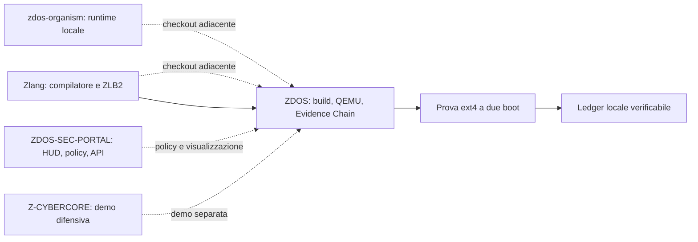

# ZDOS Connected Microcosm

Il **micro-mondo connesso** integra nel repository ZDOS il modello di coordinamento di ZDOS Lab senza creare un nuovo mirror autorevole. ZDOS rimane il nucleo che costruisce, avvia, testa e attesta; il catalogo dichiara le altre fonti primarie e rende visibile lo stato reale di ogni collegamento.

> La connessione non è una promessa generica: è una relazione dichiarata tra repository, comandi, prove osservabili e criteri di promozione.

## Architettura



Il catalogo [`microcosm/catalog.json`](../microcosm/catalog.json) è l'unica mappa operativa della fusione. Il contratto [`microcosm/contract.json`](../microcosm/contract.json) vieta la promozione automatica dei mirror e richiede che lo stato sia proporzionato alla prova disponibile.

| Area | Sede | Stato nella fusione | Criterio |
|---|---|---:|---|
| Distro Linux, bare metal, QEMU ed Evidence Chain | Questo repository | **VERIFIED** | Build, boot e attestazione locale sono versionati in ZDOS. |
| Persistenza ext4 | Questo repository | **VERIFIED** | Due boot QEMU, clean shutdown, evento attestato e ledger valido. |
| Zlang e ZLB2 | Repository primario adiacente | **PREPARED** | L'integrazione diventa verificata solo con checkout e test della fonte primaria. |
| zdos-organism | Repository primario adiacente | **EXPERIMENTAL** | Richiede le verifiche Rust dichiarate nel catalogo. |
| ZDOS-SEC-PORTAL | Repository primario adiacente | **EXPERIMENTAL** | Richiede API locale, autenticazione, validazione input e ledger valido. |
| Z-CYBERCORE | Repository primario adiacente | **EXPERIMENTAL** | Resta limitato a compilazione e simulazioni difensive locali. |

## Prova principale: persistenza attestata

Il secondo contenuto fornito corrisponde al percorso già materializzato in ZDOS: la distro crea un'immagine ext4, avvia QEMU in modalità `write`, poi in modalità `read`, controlla il filesystem con `e2fsck` e registra un evento `filesystem.persistence.attestation`. L'evidenza non contiene il contenuto del volume, ma UUID, hash dell'immagine, hash del marker, commit, kernel e risultato.

```text
build ISO → crea volume ext4 → boot QEMU write → boot QEMU read
→ clean shutdown → attestazione JSONL → verifica hash-chain
```

Questa prova dichiara esattamente ciò che mostra: **persistenza locale della distro Linux in QEMU**. Non certifica un filesystem nativo bare-metal, hardware fisico, consenso distribuito o pubblicazione remota.

## Comandi del micro-mondo

```sh
# Verifica dichiarativa e fotografia read-only dei checkout
./microcosm/zdos-microctl inspect

# Report con hash di catalogo, contratto e commit osservati
./microcosm/zdos-microctl manifest

# Controllo di sincronizzazione senza modificare nulla
./microcosm/zdos-microctl sync --check

# Aggiornamento consentito solo con working tree puliti e fast-forward
./microcosm/zdos-microctl sync --apply

# Gate locale di contratto, policy e entrypoint
./microcosm/zdos-microctl gate

# Esecuzione della prova completa e attestazione nel ledger scelto
LEDGER=/var/lib/zdos-node/evidence.jsonl \
ZDOS_KERNEL=/boot/vmlinuz-$(uname -r) \
ZDOS_MODULES_DIR=/lib/modules/$(uname -r) \
./microcosm/zdos-microctl attest-persistence
```

`sync --check` non modifica i repository. `sync --apply` non esegue reset, force-push, sovrascrittura di modifiche locali o merge non fast-forward. Se un checkout esterno è assente o sporco, l'operazione termina con una diagnosi e senza inventare uno stato positivo.

## Disposizione del workspace

Il micro-mondo assume checkout adiacenti, non copie interne alla tree ZDOS. È una convenzione intenzionale: conserva identità, commit e policy del repository di origine.

```text
workspace/
├── ZDOS/                 # nucleo e orchestratore del micro-mondo
├── Zlang/                # opzionale: fonte primaria
├── zdos-organism/        # opzionale: fonte primaria
├── ZDOS-SEC-PORTAL/      # opzionale: fonte primaria
└── Z-CYBERCORE/          # opzionale: fonte primaria
```

Quando manca un componente esterno, `inspect` lo segnala come assente e il relativo collegamento resta **PREPARED** o **EXPERIMENTAL**. Le prove locali di ZDOS non vengono per questo gonfiate né invalidate.

## Criterio di promozione

Una release del micro-mondo è dichiarabile **VERIFIED** soltanto se il catalogo e il contratto sono validi, il gate locale è verde e la prova di persistenza è stata eseguita nel contesto di build interessato. I componenti esterni devono inoltre superare i controlli della propria fonte primaria. L'assenza di prova comporta sempre uno stato inferiore, mai un'approvazione implicita.

## Riferimenti

[1] [ZDOS — repository primario](https://github.com/high-cde/ZDOS)

[2] [Zlang — compilatore e contratto ZLB2](https://github.com/high-cde/Zlang)

[3] [ZDOS Lab v1 — modello di forge coordinato](https://github.com/high-cde/ZDOS-lab-v1)
