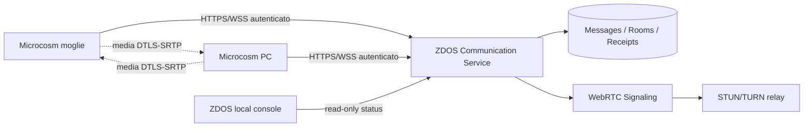

# ZComm · Chat e videochiamate — analisi tecnica

## Stato reale verificato

`zdos-microcosm-beta` possiede già un buon nucleo local-first:

- `ZCommState` persistente in AsyncStorage;
- stanze locali `Piazza ZDOS`, `Officina Zlang`, `RetroNet`;
- messaggi bounded a 240 caratteri;
- coda `pending` e retry offline;
- profilo Zlang `zcomm.local` con `HALT` obbligatorio;
- `remoteExecution: false` e `networkExposure: false`;
- sync HTTPS opzionale, ma attualmente verso un endpoint generico passato dal chiamante.

Il backend Microcosm attuale espone soltanto le route di sistema/auth previste dal template. Non ci sono ancora stanze persistenti, utenti applicativi, membership, messaggi server-side, signaling WebRTC, TURN, receipts di consegna o controllo dispositivi.

La console ZDOS ora espone correttamente:

```json
{
  "status": "LOCAL_QUEUE_READY",
  "chat": "NOT_CONFIGURED",
  "video": "NOT_CONFIGURED",
  "policy": "DEFAULT-DENY"
}
```

Non è corretto dichiarare una chat o una videochiamata attiva prima di implementare i contratti sottostanti.

## Architettura raccomandata



### Chat

1. login esplicito per entrambi gli utenti;
2. identificazione applicativa stabile, non basata su IP o nickname;
3. room privata con due membership autorizzate;
4. `message.send` con idempotency key;
5. receipt `queued`, `delivered`, `read` senza inserire contenuti nella Evidence Chain;
6. cifratura TLS in transito e cifratura a riposo del database;
7. rate limit, size limit, audit metadata e revoca sessione;
8. sincronizzazione offline tramite cursor/version, mai con `POST` generico;
9. endpoint allowlisted nel client: `https://app.x-zdos.it/api/zcomm` o percorso ufficiale equivalente;
10. fallback locale quando il backend è offline.

### Video

La videochiamata deve usare WebRTC peer-to-peer quando possibile:

- signaling autenticato su WebSocket o HTTPS long-polling;
- SDP offer/answer e ICE candidate con schema validation;
- STUN per la scoperta del percorso;
- TURN solo come relay quando NAT/firewall impedisce il percorso diretto;
- DTLS-SRTP per il media path;
- permission prompt esplicito per microfono e camera;
- pulsanti `chiama`, `accetta`, `rifiuta`, `termina` e stato `ringing/connected/ended`;
- niente registrazione audio/video finché non esiste una funzione separata con consenso esplicito;
- niente esposizione diretta della porta del PC di casa;
- notifiche push solo dopo aver definito provider e token revocabili.

## Database minimo

```text
users(id, display_name, auth_subject, created_at, revoked_at)
rooms(id, kind, created_at, created_by)
room_members(room_id, user_id, role, joined_at, revoked_at)
messages(id, room_id, sender_id, client_idempotency_key, body_ciphertext, created_at)
message_receipts(message_id, user_id, state, updated_at)
calls(id, room_id, initiator_id, state, started_at, ended_at)
sessions(id, user_id, device_id, refresh_hash, expires_at, revoked_at)
```

I messaggi personali non devono essere salvati nel ledger Evidence Chain. Nel ledger vanno soltanto eventi tecnici minimizzati: hash di manifest, esito capability, timestamp, versione schema, senza testo chat, token, password o media.

## API proposta

```text
POST /api/zcomm/rooms/:roomId/messages
GET  /api/zcomm/rooms/:roomId/messages?cursor=...
POST /api/zcomm/rooms/:roomId/read
GET  /api/zcomm/rooms/:roomId/sync?cursor=...
POST /api/zcomm/calls
POST /api/zcomm/calls/:callId/accept
POST /api/zcomm/calls/:callId/end
WS   /api/zcomm/signaling/:callId
GET  /api/zcomm/status
```

Ogni risposta deve includere `schema`, `request_id`, `server_time`, `policy` e stato. Ogni mutazione deve richiedere sessione autenticata, membership verificata e idempotency key.

## Perché non attivare ora un POST generico

La funzione attuale `syncZCommState(state, endpoint)` invia `state.pending` a qualsiasi URL HTTPS fornito dal chiamante. Prima di usarla per messaggi reali bisogna:

- rimuovere l'endpoint arbitrario;
- fissare l'origine e i path consentiti;
- firmare o autenticare la richiesta;
- verificare ownership della room;
- supportare idempotenza e cursor;
- non considerare consegnato un messaggio soltanto perché HTTP risponde 200;
- gestire cancellazione/revoca e logout;
- aggiungere test offline, replay, duplicati e membership negata.

## Fasi di implementazione

### Fase 1 — sicura e locale

- già disponibile: coda locale, UI ZComm, status bridge, default-deny;
- aggiungere un client typed che conosca solo endpoint allowlisted;
- aggiungere health e feature flags (`chat=false`, `video=false` finché backend non è pronto).

### Fase 2 — chat autenticata

- scegliere provider auth e database;
- aggiungere schema DB e API room/message;
- aggiungere test di autorizzazione tra due account;
- introdurre receipts e sync cursor;
- abilitare `chat=true` soltanto dopo gate verdi.

### Fase 3 — signaling WebRTC

- implementare call state machine;
- aggiungere signaling autenticato;
- configurare STUN e TURN;
- testare due device su Wi-Fi, NAT diverso e fallback relay;
- autorizzare camera/microfono solo al click dell'utente;
- abilitare `video=true` soltanto dopo test E2E.

### Fase 4 — deployment

- backend sempre raggiungibile su HTTPS/WSS;
- backup cifrati e retention minima;
- rate limit e monitoring senza contenuti personali;
- revoca sessioni e rotazione segreti;
- documentare privacy e consenso.

## Tool e Wi-Fi

La console Kali Neon rileva la presenza di `nmcli`, `iw`, `ip`, `systemctl`, QEMU, xorriso, GRUB, Node, Python, ffmpeg, Git e Docker. Non avvia tutto automaticamente: un tool come Docker, QEMU o un relay TURN può aprire superfici o consumare risorse. La diagnostica legge soltanto.

Wi-Fi viene osservato via NetworkManager/`nmcli` se presente. L'app non conserva password e non può cambiare rete dalla dashboard. Un eventuale modulo futuro `network.connect` deve essere separato, richiedere conferma locale e non deve essere raggiungibile dal remote control plane.

## Ubuntu, USB e CD

La console web è installabile su Ubuntu con systemd utente tramite `scripts/install-glass-engine-ubuntu.sh`. Il supporto USB/CD è un progetto distinto: il builder ZDOS attuale è un'immagine tecnica seriale/minimale e non è ancora un desktop general-purpose con Wi-Fi, installer, firmware e WebRTC. La sostituzione del sistema sul disco richiede un installer separato con backup, conferma esplicita, partizionamento e rollback.
