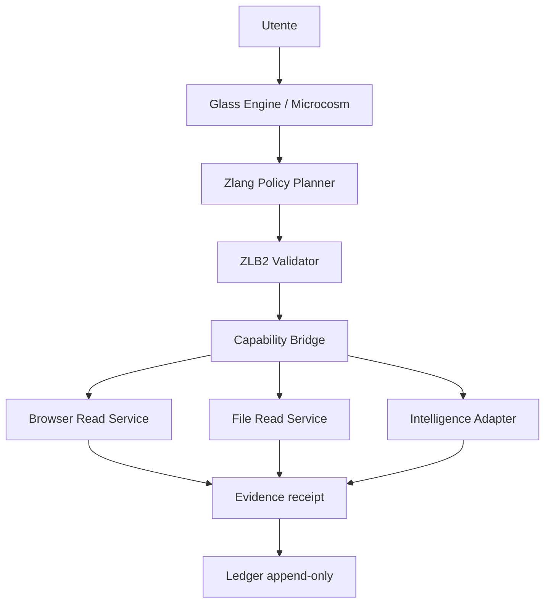

# ZDOS Intelligence Core · specifica evolutiva

## Premessa tecnica

ZDOS non deve dichiarare una “superintelligenza” già presente quando il runtime disponibile non la implementa. Il percorso verificabile è:

```text
Zlang source
  → zlangc.py
  → ZLB2 v2.5
  → ZDOS bounded runtime
  → capability bridge
  → servizio locale/remote con policy
  → receipt Evidence Chain
```

L’attuale profilo ZLB2 supporta un insieme limitato e controllabile di istruzioni (`emit`, `let`, `if`, label, `wait`, `HALT`). Questo è un vantaggio per la sicurezza: Zlang può essere il linguaggio del **piano, della policy e dell’orchestrazione**, mentre browser, storage e AI restano servizi con contratti espliciti.

## Architettura proposta



### Zlang Policy Planner

Zlang non riceve una shell. Riceve soltanto capability nominate, ad esempio:

```text
browser.page.read-v1
storage.list-v1
storage.read-v1
intelligence.plan-v1
 evidence.append-v1
```

Il bridge deve verificare identità locale, ruolo, firma del grant, namespace, quota, timeout, modalità read-only e `HALT`. Un programma non può costruire un nome capability da input arbitrario e non può chiedere `shell.exec`, `network.scan`, `camera.capture` o `credential.read`.

### File Manager

Il potenziamento corretto è un **File Manager Evidence-First**:

- root esplicita, ad esempio `~/ZDOS` o `/mnt/data`;
- `list`, `stat`, `read` e `hash` soltanto;
- path relativi e rifiuto di `..`, symlink escape, device e socket;
- limite dimensione e numero file;
- redazione di `.env`, chiavi, token e credenziali;
- preview testuale senza upload automatico;
- ogni operazione produce receipt con path relativo, dimensione, hash e policy, mai il contenuto privato;
- nessuna delete, move, chmod o write nella prima release.

La capability esistente `storage.read-v1` è il punto di partenza; `storage.list-v1` deve essere aggiunta come capability distinta, non implicata automaticamente dalla lettura.

### Anon Browser

Il nome “Anon Browser” non deve promettere anonimato assoluto. Il modulo deve essere un **Browser Read Gateway**:

- URL allowlist configurabile;
- HTTPS obbligatorio salvo `localhost` esplicito;
- timeout e limite risposta;
- nessun cookie o sessione del browser personale;
- nessun invio di form, upload, login, acquisto o comando remoto;
- rimozione script/iframe nella modalità text-read;
- niente scraping massivo, port scan o bypass di autenticazione;
- indicazione chiara di origine, timestamp e stato TLS;
- modalità Tor solo come integrazione separata, opt-in e con policy visibile.

Capability proposta: `browser.page.read-v1`. Il browser non deve diventare un tunnel per far eseguire a Zlang codice remoto.

### Intelligence Adapter

La “superintelligenza ZDOS” deve essere modellata inizialmente come **assistente bounded**:

1. riceve una richiesta testuale;
2. recupera soltanto documenti autorizzati tramite `storage.read-v1` o pagine allowlisted;
3. produce un piano strutturato con obiettivo, assunzioni, rischi, capability richieste e passi;
4. valida il piano con Zlang/ZLB2;
5. chiede conferma per ogni capability mutativa futura;
6. esegue solo capability read-only nella prima milestone;
7. crea receipt e restituisce il risultato.

Non deve:

- modificare il proprio codice o le proprie policy;
- creare nuovi privilegi;
- auto-installare pacchetti;
- aprire porte pubbliche;
- leggere password, chiavi, cookie o home intera;
- inviare messaggi o file senza capability/auth dedicata;
- eseguire comandi generati dal modello;
- dichiarare coscienza o autonomia generale.

Il modello AI può essere locale o remoto, ma è un **adapter**: l’autorità resta in ZDOS policy/bridge, non nel testo prodotto dal modello.

## Contratti proposti

```text
browser.page.read-v1
  input: { url, max_bytes, mode: text }
  output: { url, status, title, text_hash, fetched_at, source }

storage.list-v1
  input: { root, relative_path, depth, max_entries }
  output: { root, entries[], truncated, policy }

storage.read-v1
  input: { root, relative_path, max_bytes }
  output: { path, bytes, sha256, content }

intelligence.plan-v1
  input: { request, context_refs[], profile }
  output: { plan_id, steps[], capabilities[], risks[], requires_confirmation }
```

Tutte le richieste devono avere schema versionato, `request_id`, deadline e receipt. I contenuti privati non entrano automaticamente nel ledger.

## Compilazione Zlang by ZDOS

La compilazione deve usare il compilatore canonico Zlang e il profilo ZLB2, non un interprete inventato nella UI:

```bash
ZLANG_ROOT=../Zlang
python3 "$ZLANG_ROOT/tools/zlangc.py" program.zlang --header /tmp/program.h
```

Per il target bare-metal:

```bash
cd os/x86_64
make clean
make verify
sh tools/verify_qemu.sh
```

Una capability nuova non è `VERIFIED` solo perché il codice compila. Servono contratto, test di rifiuto, test di quota, prova QEMU o bridge Linux appropriato, hash e receipt.

## Milestone

### M1 — completabile ora

- `storage.list-v1` read-only;
- Browser Read Gateway text-only allowlisted;
- policy Zlang per pianificare operazioni;
- receipt e test di denial;
- UI Glass Engine per mostrare capability e limiti.

### M2 — assistente AI bounded

- adapter LLM con schema JSON;
- context refs esclusivamente da capability autorizzate;
- piano Zlang validato prima dell’esecuzione;
- nessuna mutazione automatica;
- test di prompt injection e data exfiltration.

### M3 — chat ZComm autenticata

- account e room private;
- messaggi con idempotency key e cursor;
- receipts consegna/lettura;
- sync allowlisted, non POST generico.

### M4 — WebRTC

- signaling autenticato;
- STUN/TURN;
- permessi camera/microfono;
- call state machine e test su NAT diversi;
- nessuna registrazione senza consenso.

### M5 — media USB/CD

- solo dopo driver Wi-Fi, desktop, installer, rollback e test hardware;
- l’ISO tecnica attuale non va presentata come desktop pronto.

## Criterio di successo

ZDOS diventa rivoluzionario non quando “accende tutto”, ma quando può dimostrare che ogni capacità è:

```text
compilata
→ autorizzata
→ confinata
→ osservabile
→ rifiutabile
→ riproducibile
```

Questa è la base per aggiungere intelligenza potente senza trasformare il PC, la rete o i dati personali in una superficie incontrollata.
