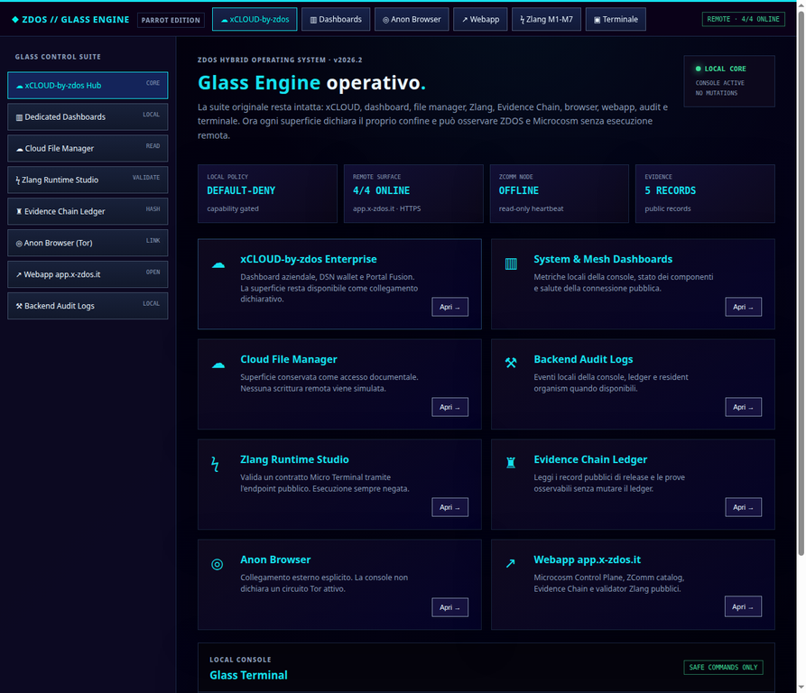

# ZDOS Glass Engine · Parrot Edition

Questa è la console web locale **read-only** di ZDOS. Preserva le superfici del Glass Engine originale — xCLOUD, dashboard, Cloud File Manager, Zlang Studio, Evidence Chain, browser, webapp, audit e terminale — ma le espone con confini espliciti e senza shell o mutazioni remote.

## Avvio

```sh
npm install
HOST=127.0.0.1 PORT=8080 npm start
```

Aprire `http://127.0.0.1:8080/`.

## Superfici locali

| Route | Funzione |
|---|---|
| `GET /status` | stato della console e policy locale |
| `GET /api/ping` | health check minimale |
| `GET /api/local/audit` | eventi locali, ledger e stato organism se presenti |
| `GET /` | Glass Engine UI |

## Adapter read-only verso `app.x-zdos.it`

L'URL remoto è fisso e allowlisted: `https://app.x-zdos.it`. Il browser parla soltanto con il server locale; il server interroga le procedure tRPC pubbliche con timeout di 7 secondi e nessuna mutazione.

| Route locale | Procedura remota |
|---|---|
| `GET /api/remote/ecosystem` | `ecosystem.list` |
| `GET /api/remote/evidence` | `evidence.list` |
| `GET /api/remote/zcomm` | `zcomm.catalog` |
| `GET /api/remote/status` | `node.status` |
| `GET /api/remote/health` | health aggregato delle procedure read-only |
| `GET /api/remote/validate?source=emit%20hello` | `zlang.validate` con profilo `zdos.zlang.microterm.v1` |

`zlang.validate` esegue soltanto validazione server-side: il risultato deve dichiarare `execution: DENIED`. Un errore o un timeout viene restituito come stato `OFFLINE`; la console non ritenta aggressivamente e non apre fallback arbitrari.

## Terminale

Il terminale grafico accetta solo comandi bounded:

```text
help
status
remote
evidence
zcomm
validate <source>
clear
```

Qualunque altro comando restituisce `DENIED` e non viene passato a shell, `subprocess`, QEMU o filesystem remoto.

## Sicurezza

- binding locale di default (`HOST=127.0.0.1`);
- policy `DEFAULT-DENY`;
- `mutations: false`;
- nessun `Access-Control-Allow-Origin: *`;
- allowlist fissa per l'origine pubblica e le procedure remote;
- payload JSON limitati e sorgenti Zlang limitate a 4096 caratteri;
- CSP, `X-Frame-Options`, `X-Content-Type-Options` e `Referrer-Policy` impostati dal server.

La console non sostituisce i gate kernel, QEMU, Zlang o Evidence Chain: li osserva soltanto quando sono disponibili nel checkout locale.

## Preview


