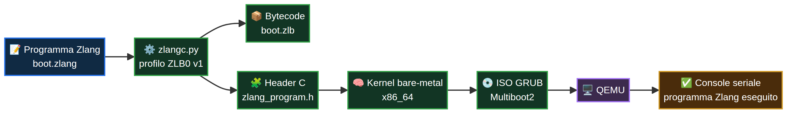

# ZDOS x86_64 — prototipo avviabile con Zlang

[](ARCHITECTURE.md)
[](tools/verify_qemu.sh)
[](../../../Zlang/blob/main/docs/zdos-x86_64-profile.md)

Questo percorso costruisce un’immagine ISO bootabile in QEMU. L’immagine contiene un kernel bare-metal x86_64, una console seriale COM1 e un runtime Zlang minimo che esegue un programma incorporato durante il boot.



## Prerequisiti

Sono necessari `gcc`, `ld`, `make`, `python3`, `grub-mkrescue`, `xorriso` e `qemu-system-x86_64`. Il compilatore Zlang viene cercato, per impostazione predefinita, nel clone affiancato `../../../../Zlang/tools/zlangc.py` rispetto a questa directory; il percorso può essere sovrascritto con la variabile `ZLANGC`.

## Compilazione totale

Dalla directory `os/x86_64`:

```sh
make clean
make all
```

La sequenza costruisce il seguente percorso:

| Passaggio | Input | Output |
|---|---|---|
| Compilazione Zlang | `programs/boot.zlang` | `build/programs/boot.zlb` e header C incorporato |
| Compilazione kernel | bootstrap assembly e C freestanding | `build/zdos.elf` |
| Packaging bootabile | kernel ELF e configurazione GRUB | `build/zdos-x86_64.iso` |

Per verificare che il kernel sia caricato da GRUB con Multiboot2:

```sh
make verify
```

Per avviare manualmente l’ISO in QEMU e osservare COM1 sulla console:

```sh
make run
```

Per eseguire la prova end-to-end automatica:

```sh
sh tools/verify_qemu.sh
```

L’esito positivo deve contenere `ZDOS x86_64 bootstrap`, `Zlang runtime ZLB2 v2.5 ready`, `ZDOS: native Zlang program executed` e `ZDOS: Zlang halted cleanly`.

Per comprendere il flusso, il formato bytecode e i confini tra programma, runtime e kernel, segui il **[Laboratorio ZDOS x86_64 + Zlang](LEARNING_PATH.md)**. La guida include esercizi riproducibili, esempi negativi e la progressione teorica verso capacità future.

## Profilo Zlang disponibile

Il profilo corrente è **ZLB2 v2.5**. Il compilatore accetta `emit`, `let`, `if`, label e `wait`; il runtime bootstrap esegue `emit`, valida tutti i record riconosciuti e attraversa in sicurezza le istruzioni non ancora eseguite.

```zlang
emit Testo da inviare alla console seriale
let node_id = 2026
if node_id == 2026 jump secure
secure:
wait
```

Righe vuote e commenti con `#` sono ignorati. Ogni altra sintassi viene rifiutata dal compilatore con exit status non-zero. Il runtime nel kernel convalida magic, versione, opcode, lunghezze e terminazione; non esegue bytecode sconosciuto.

## Limiti espliciti

Questo è un **prototipo di OS avviabile**, non un sistema operativo generale. Non include ancora processo utente, scheduling, filesystem, driver, rete, multitasking, isolamento di memoria, caricamento ELF, package manager o syscall pubbliche. Il programma Zlang è incorporato nel kernel per dimostrare una catena nativa verificabile; un loader di programmi esterni è un passo futuro, non una funzionalità già disponibile.
